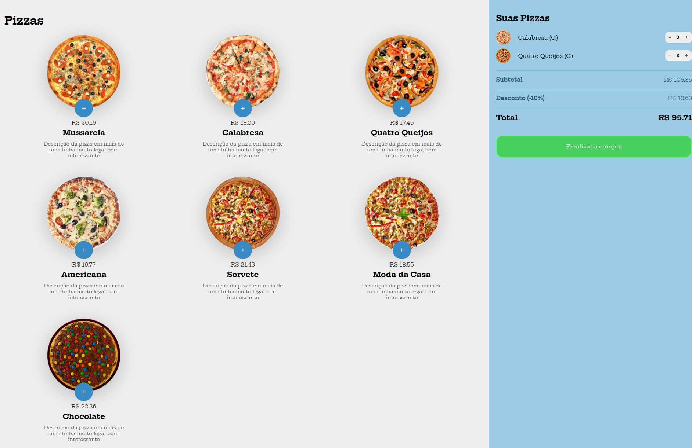

<h1 align="center" style="font-weight: bold;">GetYourPizza</h1>

<p align="center">
  <a href="#tech">Tecnologias</a> • 
  <a href="#about">Sobre</a> •
  <a href="#started">Começando</a> • 
  <a href="#colab">Colaboradores</a> •
  <a href="#contribute">Contribuir</a>
</p>

<p align="center">
    <b>O GetYourPizza é uma aplicação web interativa que permite aos usuários visualizar, escolher e adicionar pizzas ao carrinho de compras. O sistema também calcula automaticamente o subtotal, desconto e total da compra, proporcionando uma experiência dinâmica e amigável ao usuário.</b>
</p>

<h3>Layout</h3>



<h2 id="tech">Tecnologias</h2>

- [HTML](https://devdocs.io/html) - Estruturação do layout.
- [CSS](https://devdocs.io/css) - Estilização e responsividade.
- [JavaScript](https://devdocs.io/javascript) - Manipulação de DOM.

<h2 id="about">Sobre</h2>

<p>Este projeto foi desenvolvido com o objetivo de criar um sistema simples e funcional para compras de pizzas online. A interface permite que os usuários visualizem as pizzas disponíveis, selecionem tamanhos, ajustem quantidades e finalizem a compra com um cálculo automático de valores.</p>

<h3>Funcionalidades</h3>

- Exibição dinâmica de pizzas disponíveis para compra.
- Seleção de diferentes tamanhos de pizza.
- Adição e remoção de pizzas do carrinho.
- Cálculo automático do subtotal, desconto e total.
- Interface responsiva para dispositivos móveis.
- Modal interativo para exibição detalhada de cada pizza.
- Atualização dinâmica do carrinho de compras.

<h2 id="started">Começando</h2>

1. **Clone este repositório:**

```bash
git clone https://github.com/vdonoladev/GetYourPizza.git
```

2. **Navegue até o diretório do projeto:**

```bash
cd GetYourPizza
```

4. **Execute o arquivo:**

- Abra o arquivo `index.html` no navegador.

<h2 id="colab">Colaboradores</h2>

Agradecimento especial a todas as pessoas que contribuíram para este projeto.

<table>
  <tr>
    <td align="center">
      <a href="#">
        <br>
        <sub>
          <b>Víctor Donola Ferreira</b>
        </sub>
      </a>
    </td>
  </tr>
</table>

<h2 id="contribute">Contribuir</h2>

1. `git clone https://github.com/vdonoladev/GetYourPizza.git`
2. `git checkout -b feature/NAME-OF-FEATURE`
3. Siga os **Commit Patterns**
4. Abra um **Pull Request** explicando o problema resolvido ou o recurso feito, se houver, anexe a captura de tela das modificações visuais e aguarde a revisão!

<h3>Documentações que podem ajudar</h3>

- [📝 How to create a Pull Request](https://www.atlassian.com/br/git/tutorials/making-a-pull-request)

- [💾 Commit pattern](https://gist.github.com/joshbuchea/6f47e86d2510bce28f8e7f42ae84c716)
